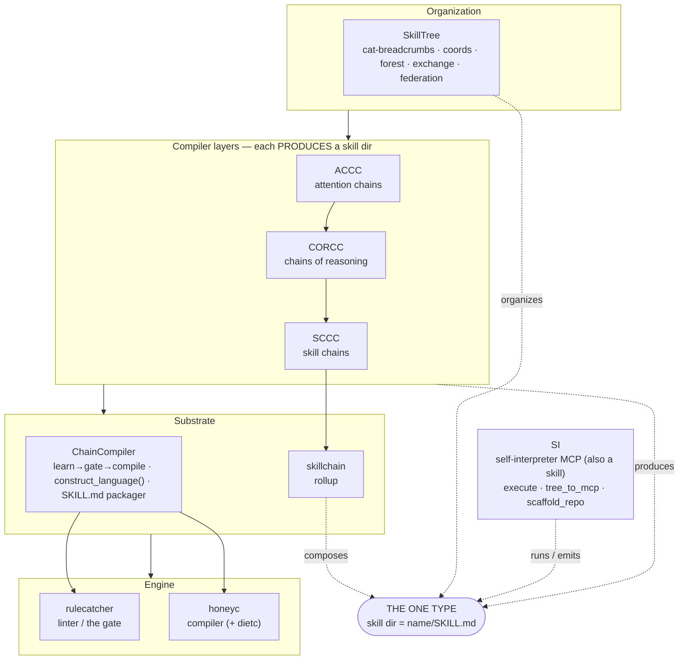
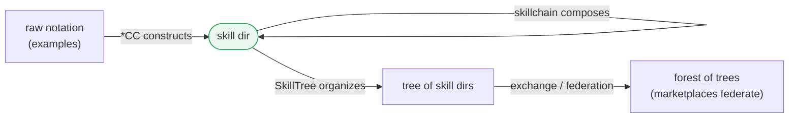
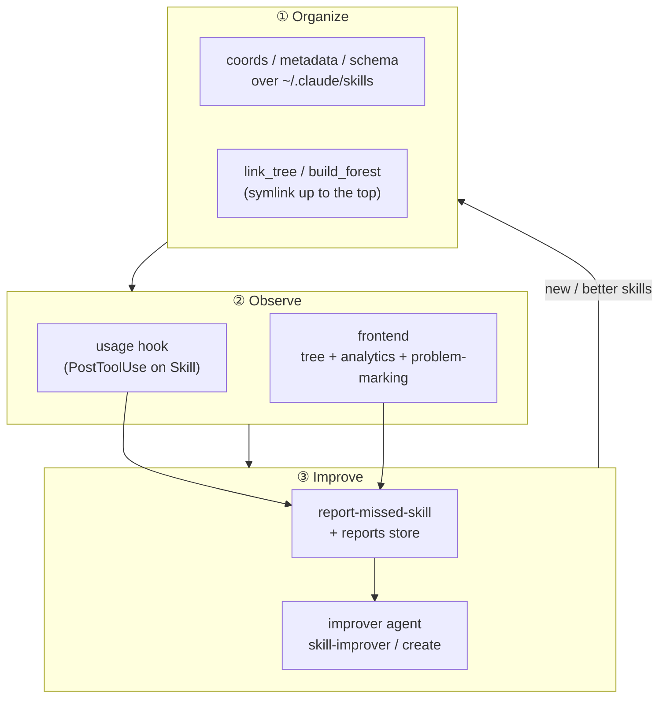
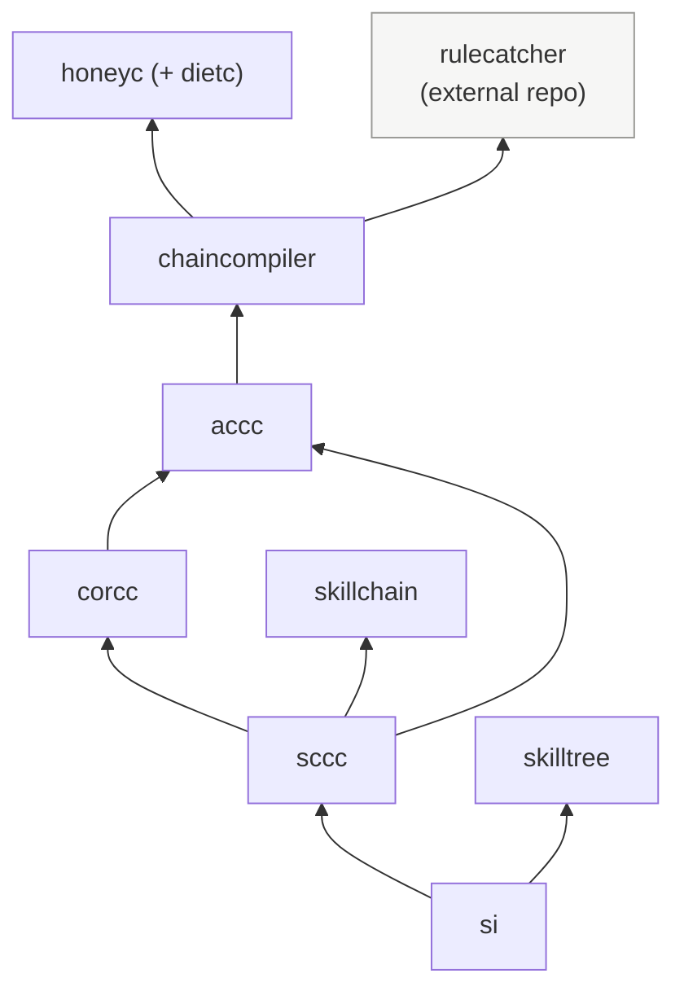

# Rule: ChainCompiler architecture — component diagrams

The static structure of the system. Every aspect has a component diagram here;
when you change the architecture, update the matching diagram in the same change.

The whole system is **a closed algebra over one type — the skill dir**
(`<name>/SKILL.md`, the unit any agent auto-loads). Every layer produces or
consumes only that type, so composition closes and recurses.

---

## 1. The full stack

---

## 2. The closed algebra (one type, three operations)

`*CC`s are **constructors** (lift notation into the type); `skillchain` is the
**composition operator** (closed: an SC can chain an SC); `SkillTree`/exchange/
federation are the **arrangement**. Validators do what the substrate won't.

---

## 3. Skill OS (P6) — three rings over the global namespace

The system **grows from its own gaps**: usage + reports feed improvement, which
feeds back into the organized namespace. Same closure, one ring higher.

---

## 4. Package dependency graph (monorepo)

(Arrows point from a package to what it depends on. `chaincompiler` also re-exports
`construct_language`; `accc`/`corcc`/`sccc`/`si` all build on it.)

`rulecatcher` is an **external** dependency (its own repo); everything else is a
package in this monorepo under `packages/`.
