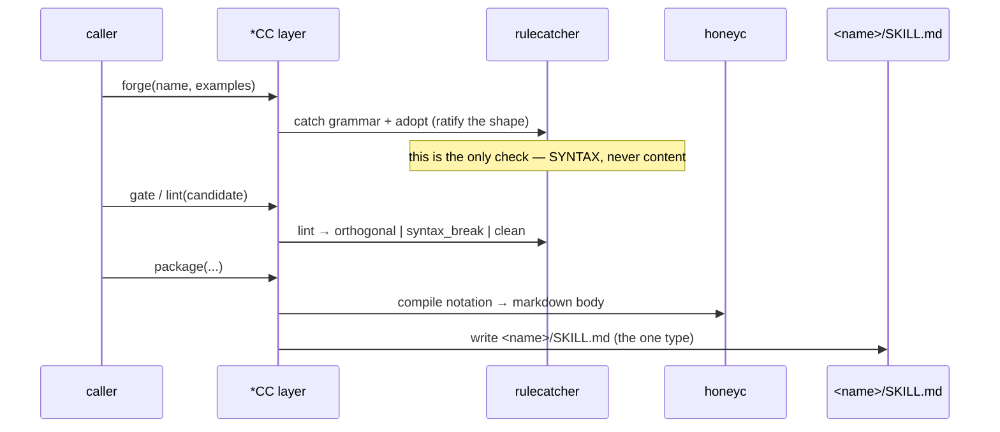
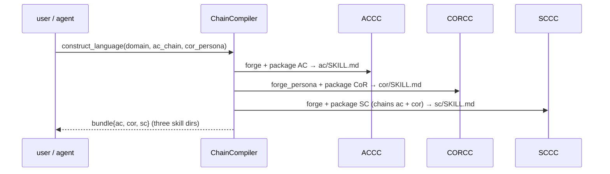
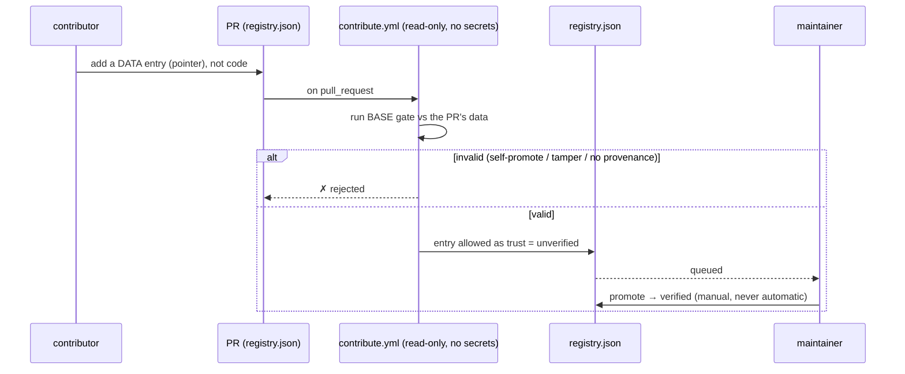
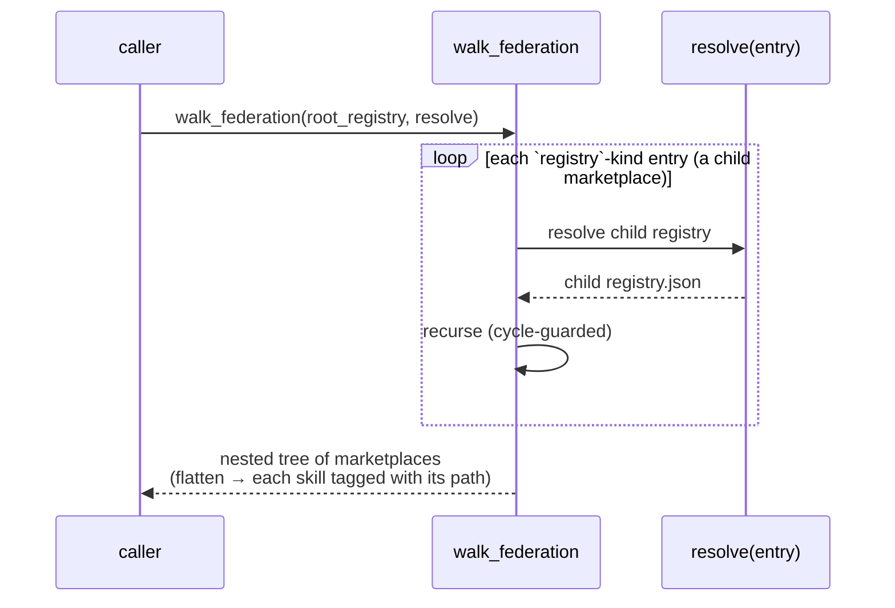
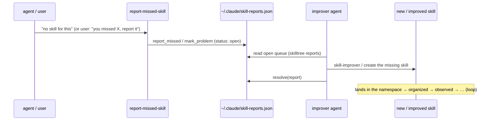

# Rule: ChainCompiler architecture — sequence diagrams

The runtime flows. Every key activity boundary has a sequence diagram here; when
you change a flow, update the matching diagram in the same change.

---

## 1. The compiler loop — how a `*CC` mints a skill

Every `*CC` (ACCC/CORCC/SCCC) runs the same loop on the engine.



---

## 2. `construct_language` — mint a whole domain language



---

## 3. SkillTree — surface up, then `cat` down (progressive disclosure)

A skill dir's nested `.claude/skills` is **not** auto-loaded (the scan is
non-recursive within `.claude/skills`). So entry points are symlinked UP to the
top, and the agent `cat`s DOWN the breadcrumbs.

```mermaid
sequenceDiagram
    participant Dev as builder
    participant ST as skilltree
    participant User as ~/.claude/skills
    participant CC as Claude Code
    participant Ag as agent (session)
    Dev->>ST: materialize(tree, coords=True) + link_tree
    ST->>User: symlink root + branches (0-root, 0.1-…)
    Note over CC,User: session start → auto-loads ONLY the top entries
    CC->>Ag: available skills = root + first layer (coord-sorted)
    Ag->>Ag: cat <breadcrumb to child>  (= work in child subdir)
    Note over Ag: on-demand load of that child's skills; leaves stay hidden until reached
```

---

## 4. Contribution gate — validate → queue → gated promote (P5)

The marketplace is a git repo; a contribution is a PR editing `registry.json`.
The gate is **fork-safe** and runs the BASE copy of itself, never the PR's.



---

## 5. Federation walk — a tree of marketplaces



---

## 6. The Skill OS loop — grow from your own gaps (P6)


