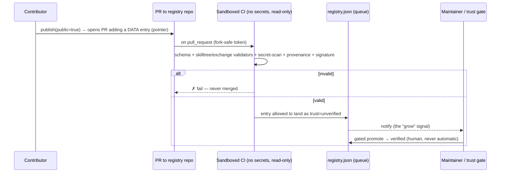

<div align="center">

# P5 — Federation (plan)

*Every emitted MCP becomes a ChainCompiler-shaped repo; its marketplace federates under ours.
The marketplace **is a git repo**. Public skills are **untrusted by default**.*

</div>

> **Status: planned.** This is the design we agreed on — not built yet. Decisions locked:
> **(1)** contributions are *validated + queued + gated-promote* (no auto-merge of agent content);
> **(2)** the marketplace **is a GitHub repo** (no separate backend).

---

## 1. The fractal

The closure, lifted from skill dirs to whole repos:

| level | unit | composes via |
|---|---|---|
| done | skill dir | skillchain |
| done | skill tree | exchange master |
| **P5** | **ChainCompiler-shaped repo** | **marketplace federation** |

When the SI emits an MCP (`tree_to_mcp`), it also **scaffolds a repo with the identical layout +
mechanics** (roadmap, site, changelog, deploy, exchange, marketplace) — a full ChainCompiler instance,
a *node repo*. Each node repo's marketplace **registers under** its parent's. Marketplaces form a tree
mirroring the repo tree.

---

## 2. The marketplace IS a repo

No backend. The registry is a file in a repo; contributing is a PR; federation is a repo reference.

```jsonc
// registry.json — entries are DATA (pointers), never code we run
{
  "name": "my-marketplace",
  "parent": "github:org/chaincompiler-registry",   // federate up (null at the root)
  "entries": [
    {
      "name": "debug-attn", "kind": "skill",         // skill | tree | exchange | mcp
      "repo": "github:alice/debug-attn", "manifest": "skilltree.json",
      "version": "0.1.0", "trust": "unverified",      // unverified → verified → featured
      "provenance": { "by": "alice", "sha": "…", "at": "…" }, "signature": "…"
    }
  ]
}
```

A consumer sets a **trust floor** (e.g. load only `verified`) — public entries are **untrusted by default**.

---

## 3. Contribution flow (the notifier, done safely)



**Why this and not auto-merge:** a `SKILL.md` body is *instructions an LLM will follow*. Auto-merging
public skills into a registry agents auto-load is a **self-propagating prompt-injection vector**. And a
workflow triggered by outside contributions must run with a **read-only, no-secret token** (the GitHub
fork-PR default) — never `pull_request_target` with write/secrets over untrusted content.

---

## 4. Security model

- **Data, not code.** We store pointers + validated metadata; we never execute a contributor's code in our workflow.
- **Sandboxed validation.** `pull_request` (not `_target`), read-only token, no secrets, isolated job.
- **Untrusted by default.** New entries are `unverified`; promotion is gated; consumers choose a trust floor.
- **Provenance + signatures.** Every entry records who/when/sha and is signed; federation carries provenance up.
- **No agent auto-execution of public skills** without an explicit trust decision.

---

## 5. Build steps (when we proceed)

1. **Repo scaffolder** — `tree_to_mcp` also `scaffold_repo(node)`: stamp a ChainCompiler-shaped repo (reuse `update_site.py`, `deploy.yml`, `exchange`, `marketplace`).
2. **Registry-as-repo** — formalize `registry.json` schema + a `registry` validator; `marketplace.publish` writes a PR-shaped entry instead of a local row.
3. **Contribution workflow** — `.github/workflows/contribute.yml`: fork-safe, sandboxed, runs validators + scan + provenance, lands `unverified`, notifies.
4. **Federation** — child registry sets `parent`; a `federate` step references child registries from the parent (pointer, not content).
5. **Trust + promotion** — `promote` command/gate (human first; reputation/staking later, aspirational).

---

*Back to the [roadmap](ROADMAP.md) · [README](README.md).*
