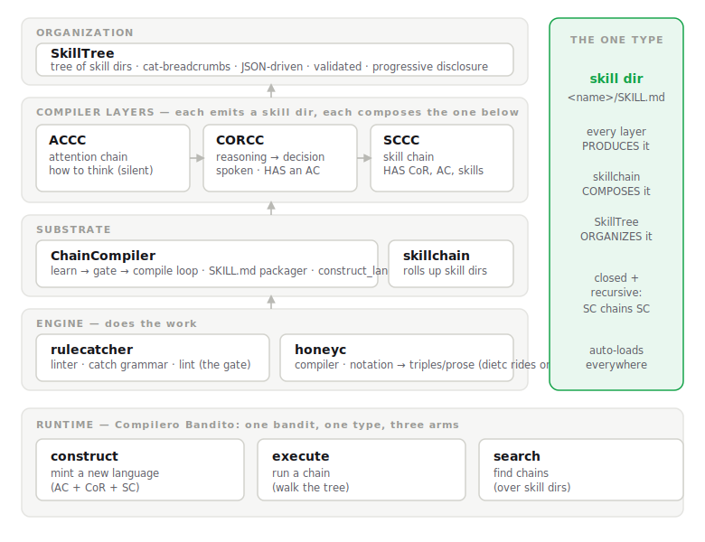
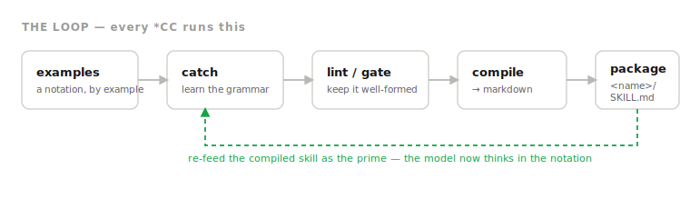
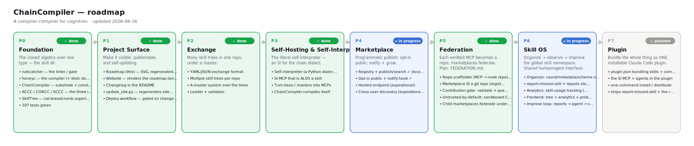
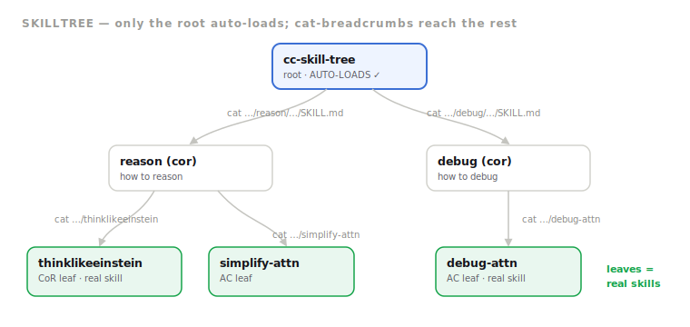

<div align="center">

# ChainCompiler

### A compiler-compiler for cognition.

*Define a notation. Gate it so the model never malforms it. Compile it into a universally-loadable skill. Compose those skills. Organize them into a navigable tree. Code validates every step.*

<br/>

   

<br/>



</div>

---

## Why

LLMs learn **in-context** — give the model a notation and it thinks in that notation. The hard part was never running one notation; it was *minting, checking, composing, and organizing* them reliably. ChainCompiler is the machine for that. The point isn't any single notation — it's the factory that produces them, with a linter at every seam so the model can't drift out of its own syntax.

> **It is all syntax, by design.** Nothing here judges whether a chain's *content* is good. The compilers guarantee **well-formed, composable, organized** artifacts. Correctness of thought is not their job — and that boundary is load-bearing.

---

## The one idea: a closed algebra over one type

Everything reduces to a single type — the **skill dir** (`<name>/SKILL.md`), the unit any agent auto-loads. Every operation produces or consumes only that type, so composition **closes and recurses**:

```
*CC            constructs   →  skill dir       (lift a notation into the type)
skillchain     composes     →  skill dir       (a skillchain OF skillchains)
SkillTree      organizes    →  skill dirs      (a navigable tree of them)
```

The `*CC`s are *constructors*, `skillchain` is the *composition operator*, `SkillTree` is the *arrangement*, and validators do the job the substrate refuses to.

---

## The loop — every `*CC` runs this

<div align="center">

</div>

---

## Roadmap

<div align="center">

</div>

**P0 Foundation** `✓` · **P1 Project Surface** `✓` · **P2 Exchange** `✓` · **P3 Self-Hosting & SI** `✓` · **P4 Marketplace** `▸` · **P5 Federation** `○` ([plan](FEDERATION.md))

Full detail in **[ROADMAP.md](ROADMAP.md)**, rendered live on the **[site](site/)**. The image and the site are *generated* from [`roadmap.json`](roadmap.json) by [`scripts/update_site.py`](scripts/update_site.py) — edit the data, run the script, everything updates.

---

## The stack, layer by layer

<details>
<summary><b>🐝 rulecatcher</b> — the linter / gate <i>(the engine's left half)</i></summary>

<br/>

Learns a notation's grammar from examples (`catch`), then lints text against it (`lint`) with a two-axis verdict:

- **`orthogonal`** — a known token in the wrong slot → *steerable* (rotate it).
- **`syntax_break`** — a token foreign to the language → *fatal*.

This is the gate that keeps the model writing valid custom syntax. *(Lives at `~/Documents/New project/rulecatcher`.)*

```bash
rulecatcher catch examples.txt --scope mydsl
rulecatcher lint  newtext.txt  --scope mydsl   # non-zero on a violation → CI-gateable
```
</details>

<details>
<summary><b>🍯 honeyc</b> — the compiler <i>(the engine's right half)</i></summary>

<br/>

Parses the **Dense Rune-Chain** glyph notation (`🌸‍💧 → 🍯 → 🍹`) into an AST, then renders it through lenses: triples, Prolog, Cypher, prose. `dietc` (a modular-nutrition compiler) rides on top — proof that honeyc hosts arbitrary domain compilers.

```bash
honeyc norm   examples/mbr.rune
honeyc render examples/mbr.rune --as prose
```
</details>

<details>
<summary><b>⛓️ ChainCompiler</b> — the substrate + umbrella <i>(this package)</i></summary>

<br/>

Wires the linter + compiler into the `learn → gate → compile` loop, writes the result as a `SKILL.md`, and exposes the top-door `construct_language()`. One name over the whole stack.

```bash
chaincompiler layers     # print the stack
chaincompiler demo       # mint a whole 'triage' cognition-language in one call
```
</details>

<details>
<summary><b>🎯 ACCC</b> — Attention Chains <i>(the atom)</i></summary>

<br/>

An **attention chain** is *inner* — a silent template for **how to think** about something (a scaffold for a section or your thinking). Not necessarily spoken.

```rune
[Symptom] ⇒ [Repro] ⇒ [Hypothesis] ⇒ |Localize|
```

`forge()` mints a *new* AC language (the compiler-compiler move); `gate()` lints it; `package()` emits the skill dir.
</details>

<details>
<summary><b>🗣️ CORCC</b> — Chains of Reasoning <i>(spoken; HAS an AC)</i></summary>

<br/>

A **CoR** is a *spoken, paragraphical AC that makes a decision*. Same chain, two registers: the inner AC (silent) generates it; the outer CoR is the paragraph the model says. The lint is the only check — a malformed CoR means the model drifted out of syntax ("melting").

```rune
[Invariants] ⇒ [ThoughtExperiment] ⇒ [Simplicity] ⇒ |Reframe|   # ThinkLikeEinstein
```
</details>

<details>
<summary><b>🧩 SCCC</b> — Skill Chains <i>(the highest composite)</i></summary>

<br/>

An **SC** chains ACs + CoRs + **regular skills** into a sequence, rolled up into one `SKILL.md`. Because everything is a skill dir, an **SC can chain another SC** — the algebra closes.

```rune
[ac:debug-attn] ⇒ [cor:thinklikeeinstein] ⇒ [skill:summarize] ⇒ |Answer|
```
</details>

<details>
<summary><b>🌳 SkillTree</b> — the organization <i>(progressive disclosure in the filesystem)</i></summary>

<br/>

See the next section — it has its own diagram and a live example.
</details>

---

## SkillTree — a tree you `cat` your way down

Claude Code auto-loads **only the root** `.claude/skills/` and **won't descend** into a nested `.claude`. So the tree lives in **`cat`-breadcrumbs**: each node's `SKILL.md` body hands you the `cat` command for its children. Load one root, walk to the exact leaf you need — nothing else pollutes context. It's progressive disclosure implemented in the filesystem, **JSON-driven**, and **validated** (the platform never checks the breadcrumbs — so we do).

<div align="center">

</div>

<details>
<summary><b>The real <code>cc_tree_test</code> — on disk</b></summary>

<br/>

```
cc_tree_test/
  .claude/skills/cc-skill-tree/SKILL.md          ← root (the ONLY thing that auto-loads)
  reason/.claude/skills/reason/SKILL.md
  reason/thinklikeeinstein/.claude/skills/thinklikeeinstein/SKILL.md   ← real CoR leaf
  reason/simplify-attn/.claude/skills/simplify-attn/SKILL.md
  debug/.claude/skills/debug/SKILL.md
  debug/debug-attn/.claude/skills/debug-attn/SKILL.md                  ← real AC leaf
```

The root's body — the breadcrumbs:

```markdown
## Descend — the next layer (2)
Auto-load stops here (nested `.claude` will not load). To go deeper, run the `cat`:

- reason (cor): `cat /…/cc_tree_test/reason/.claude/skills/reason/SKILL.md`
- debug  (cor): `cat /…/cc_tree_test/debug/.claude/skills/debug/SKILL.md`
```
</details>

```bash
skilltree build cc_tree_test.manifest.json cc_tree_test   # JSON → tree, then validate
skilltree validate cc_tree_test                            # every breadcrumb must resolve
```

The manifest is the org chart — **edit it however you want, rebuild, and every breadcrumb + dir regenerates.**

---

## Quickstart

```bash
# install every package in the monorepo, editable. rulecatcher is an EXTERNAL
# dependency (its own repo) — install it first, then run this.
./install.sh            # pip install -e packages/* (no-deps)

chaincompiler demo      # construct a 'triage' language: AC + CoR + SC in one call
sccc        demo        # chain an AC + CoR + skill into one SKILL.md
skilltree   demo        # build a cat-breadcrumb tree, walk it, break a crumb → caught
```

```python
import chaincompiler as cc
from corcc.notation import EINSTEIN
bundle = cc.construct_language(
    "triage",
    ac_chain="[Symptom] ⇒ [Scope] ⇒ |Severity|",
    cor_persona=EINSTEIN,
    db=".cc.db", skills_dir="skills", out_dir="dist",
)   # → bundle.ac / bundle.cor / bundle.sc  (three SKILL.md packages)
```

---

## Repo layout

```
chaincompiler/                 # the monorepo (this repo)
  README · ROADMAP · FEDERATION · roadmap.json   # project surface
  assets/ · site/ · scripts/ · .github/          # roadmap SVG, site, generators, deploy
  packages/
    chaincompiler/   accc/   corcc/   sccc/       # substrate + the three layers
    skilltree/   si/   honeyc/   skillchain-compiler/
```

`rulecatcher` is an **external dependency** (its own repo) — install it first, then `./install.sh`.

---

## The formal spec

```
SKILL_DIR   IS A <name>/SKILL.md            (self-describing, auto-loadable)
AC          IS A attention-template          (how to think; inner, silent)
COR         IS A spoken AC that decides       →  COR HAS AC
SC          IS A sequence                      →  SC HAS COR, AC, skills
*CC         IS A syntax compiler               →  *CC PRODUCES SKILL_DIR
skillchain  PRODUCES SKILL_DIR from SKILL_DIRs (composition closes)
SkillTree   IS A tree of SKILL_DIRs            (wired by cat-breadcrumbs)
```

---

## Changelog

### v0.1.4 — 2026-06-16
- **Monorepo + published** — consolidated the 8 packages under `packages/` (rulecatcher stays an external dep), `install.sh`, and pushed to a private GitHub repo. 117 tests green post-move.
- **Deploy workflow decoupled** — split into a `validate` job (changelog gate + regenerate + staleness, runs on every push) and a `deploy` job gated on public visibility (Pages needs a public repo), so private pushes stay green.

### v0.1.3 — 2026-06-16
- **P5 Federation** — *planned*: design locked in **[FEDERATION.md](FEDERATION.md)**. Each emitted MCP becomes a ChainCompiler-shaped repo; the marketplace **is a git repo** (registry = `registry.json`, contribute = PR); contributions are **validated + queued + gated-promote** (no auto-merge); public skills are **untrusted by default** (SKILL.md = agent instructions = injection surface).

### v0.1.2 — 2026-06-16
- **P3 Self-Hosting & Self-Interpreter** ✓ — `si`: a chain-dialect interpreter (a Python dialect; defers to native ops), the tree-walk **execute** arm, `tree_to_mcp`, and an **SI MCP server that is also a skill** (`python -m si.server`, 5 tools). `construct_language` runs *inside* the dialect → ChainCompiler self-hosts.
- **P4 Marketplace** ▸ — `skilltree.marketplace`: programmatic `publish`/`search`, opt-in `public`, and a `notify` hook where a hosted service plugs in (hosted endpoint + cross-user discovery still aspirational).

### v0.1.1 — 2026-06-16
- **P1 Project Surface** ✓ — roadmap (SVG from data), dynamic site, changelog, `update_site.py`, changelog-gated deploy workflow.
- **P2 Exchange** ✓ — `skilltree.exchange`: a JSON/YAML manifest holds many skill trees under a master (a tree of trees); `build` + `validate`. CLI: `skilltree exchange build/validate`.

### v0.1.0 — 2026-06-16
- Foundation complete: `rulecatcher`, `honeyc`/`dietc`, `ChainCompiler`, `ACCC`/`CORCC`/`SCCC`, `SkillTree` — 107 tests.
- `construct_language()` mints a domain's AC + CoR + SC in one call.
- `SkillTree`: `cat`-breadcrumb trees from JSON with a validator; live `cc_tree_test`.
- Project surface: roadmap (SVG generated from data), dynamic website, this changelog, `update_site.py`, changelog-gated deploy workflow.

---

## Status

| package | is | tests |
|---|---|---|
| `rulecatcher` | the linter / gate | 43 |
| `honeyc` (+ `dietc`) | the compiler (+ domain proof) | 36 |
| `chaincompiler` | substrate + umbrella | 6 |
| `accc` / `corcc` / `sccc` | the three layers | 5 / 5 / 6 |
| `skilltree` | the organization | 6 |

**~107 passing.** Anchored by two proofs: `csgn-rulecatcher` (rulecatcher catching a real categorical-notation grammar) and the dense-rune origin docs.

### Not done yet (honestly)

- **`execute` / `search`** — the bandit's other two arms. `construct` is end-to-end; a programmatic `skilltree walk` is sketched, not built.
- **Global install** — everything lives in `~/fable_test`. Nothing auto-loads into real sessions until a tree/language lands in `~/.claude/skills`.
