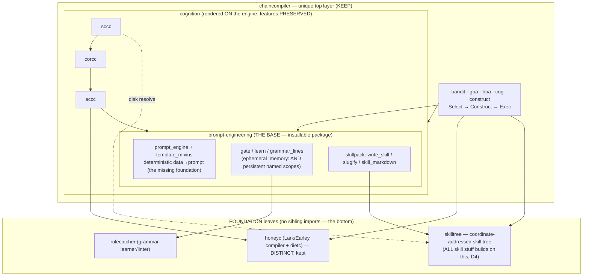
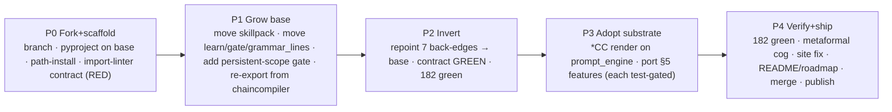

# CHAINCOMPILER REBUILD SPEC — prompt-engine base, cycle → DAG

> Canonical design doc for the rebuild (rule 26). Branch: `rebuild/prompt-engine-base`.
> Date: 2026-06-28. Anything marked `ASPIRATIONAL:` is a commitment not yet implemented.

## 0. Locked decisions

- **D1 — `prompt-engineering` IS the base.** The standalone repo `~/claude_code/prompt-engineering`
  becomes the single foundation. `chaincompiler` **and** `accc/corcc/sccc` depend **DOWN** on it.
  One source of truth for the prompt engine + the grammar gate + the shared `write_skill`/`slugify`
  utilities. No duplicated engine code, no drift.
- **D2 — Full rebuild.** Not just break the cycle: also adopt `prompt_engine` as the deterministic
  rendering substrate the `*CC` packages render **through**, while **porting every feature** the
  current (simplified) skill `cognition.py` dropped. No capability regression. This is the
  "good once it's done" version.
- **D3 — One `rulecatcher`.** Un-vendor the skill's `lib/rulecatcher/`; both the base and the `*CC`
  depend on the single `packages/rulecatcher` leaf. One linter, no vendor-drift.
- **D4 — `skilltree` is the bottom-level foundation.** ALL skill stuff is built with `skilltree` — the
  skill-packaging layer (`write_skill` / `skill_markdown` / the SKILL.md tree) places skills as
  **coordinate-addressed** tree nodes (rule 25), not loose dirs. `skilltree` is a foundation leaf
  *below* the base; the base's skill-packaging **and** `chaincompiler`'s GBA/COG **and** `sccc`'s
  step-resolver all depend DOWN on it. `write_skill` becomes `skilltree`-aware.

Everything below is derived from the cold audit (cross-package seam map + old↔new divergence +
core/test/site inventory).

---

## 1. The disease — why this rebuild exists

Two structural inversions in the published monorepo:

1. **A dependency CYCLE.** `chaincompiler` imports `accc/corcc/sccc`, and `accc/corcc/sccc` import
   `chaincompiler` back — all in production `src/`. (Masked at import-time by
   `chaincompiler/__init__.py`'s lazy `__getattr__`, but it closes the moment `construct`/`bandit`/`cli`
   is touched.)
2. **No deterministic prompt engine at the base.** `accc/forge.py` and `sccc/forge.py` build prompts
   *through* `rulecatcher` (the grammar-induction gate) — i.e. prompt-making sits **on top of** the
   linter instead of the linter being an optional layer on top of a prompt engine. The base layer
   (a deterministic `data → prompt` builder) **never existed** here; it was later written, clean, in
   the `prompt-engineering` skill.

### The exact back-edges (the wrong-way imports — these get cut)

| file:line | imports (UP, from chaincompiler) | symbols |
|---|---|---|
| `packages/accc/src/accc/forge.py:12` | `from chaincompiler import write_skill` | `write_skill` |
| `packages/accc/src/accc/forge.py:13` | `from chaincompiler.bridge import grammar_lines, learn` | `grammar_lines`, `learn` |
| `packages/accc/src/accc/forge.py:14` | `from chaincompiler.bridge import gate as _gate` | `gate` |
| `packages/corcc/src/corcc/forge.py:23` | `from chaincompiler import write_skill` | `write_skill` |
| `packages/sccc/src/sccc/forge.py:16` | `from chaincompiler import slugify` | `slugify` |
| `packages/sccc/src/sccc/forge.py:17` | `from chaincompiler.bridge import gate as cp_gate` | `gate` |
| `packages/sccc/src/sccc/forge.py:18` | `from chaincompiler.bridge import learn` | `learn` |

Every symbol the `*CC` reach UP for is a **leaf utility** — `write_skill`/`slugify` (from
`skillpack.py`, stdlib-only) and `learn`/`gate`/`grammar_lines` (from `bridge.py`, which only touches the
clean leaves `rulecatcher` + `honeyc`). **None of them re-import `accc/corcc/sccc`.** So moving these
five symbols DOWN into the base turns all seven back-edges into down-edges and the cycle dissolves.

The forward edges (`chaincompiler → {accc,corcc,sccc}` in `construct.py`, `bandit.py`, `cli.py`) are
correct and **stay** — they become clean down-edges once the back-edges are gone.

---

## 2. Target architecture (the DAG)

**The one rule:** imports only ever point **down**. `BASE` depends on nothing in the monorepo except
the two leaves (`rulecatcher`, `honeyc` — and `honeyc` only via chaincompiler's compile path, see §6).
This rule is **enforced by a harness** (import-linter contract, §10), not just stated.

---

## 3. The BASE — `prompt-engineering` grows into the foundation

Today `prompt-engineering` is a *skill* (`SKILL.md` + `lib/…`, stdlib-only, its own git repo, no
`pyproject.toml`). To become the base everyone installs:

**P-add-1 — make it an installable package.** Add `pyproject.toml`. Import name `prompt_engineering`
(modules re-exported at top level). Dev: `pip install -e ../prompt-engineering` into the chaincompiler
env (path dep). Dist name on PyPI resolved at publish time (`prompt-engineering` may be taken → prefix;
see §11). The skill mount (`~/.claude/skills/prompt-engineering` symlink) is unaffected.

**The API surface the base MUST expose** (consumed by the cut back-edges + the full rebuild):

| symbol | source today | action |
|---|---|---|
| `render`, `render_template`, `render_file`, `list_templates` | `prompt-engineering/lib/prompt_engine.py` | already there — the deterministic builder |
| `gate(text, exemplars=…)` (ephemeral) | `prompt-engineering/lib/gate.py` | already there |
| `gate(…, scope=…/db=…)`, `learn`, `grammar_lines`, `adopt`, `export_scope`, `import_scope` (**persistent named scopes**) | re-expose `lib/rulecatcher/` DB API that `gate.py` hides behind `:memory:` + port `chaincompiler.bridge.{learn,grammar_lines}` | **PORT** — the `*CC` need persistent, exportable grammar scopes; ephemeral-only is a regression (§5) |
| `write_skill`, `skill_markdown`, `slugify` | `chaincompiler/packages/chaincompiler/src/chaincompiler/skillpack.py` (stdlib-only) | **MOVE** into the base **and rebuild on `skilltree`** — coordinate-addressed placement, not loose dirs (D4); `chaincompiler` re-exports the names (§8) |
| `render_cor`, `render_attention_chain`, `render_skillchain`, `make_persona`, cognition payloads | `prompt-engineering/lib/{cognition,persona}.py` | already there — extended to feature-parity in §5 |

**Base dependencies** (the only non-stdlib things below it): `rulecatcher` (D3 — gate) and `skilltree`
(D4 — skill-packaging). Both are foundation leaves; the base depends DOWN on them. The prompt engine
itself (`render`/`template_mixins`) stays pure stdlib.

> **rulecatcher single-copy — DONE (D3):** un-vendored `prompt-engineering/lib/rulecatcher/`; the base
> now depends on the single `packages/rulecatcher` leaf (`from rulecatcher… import …` resolves to the
> installed package). One linter, no vendor-drift.

---

## 4. The dependency-inversion cuts (exact edits — P2)

Repoint the seven back-edges. `<base>` = `prompt_engineering`.

| file:line | from | to |
|---|---|---|
| `accc/forge.py:12` | `from chaincompiler import write_skill` | `from prompt_engineering import write_skill` |
| `accc/forge.py:13` | `from chaincompiler.bridge import grammar_lines, learn` | `from prompt_engineering import grammar_lines, learn` |
| `accc/forge.py:14` | `from chaincompiler.bridge import gate as _gate` | `from prompt_engineering import gate as _gate` |
| `accc/forge.py:15` | `from rulecatcher.db import connect, list_rules` | `from prompt_engineering import open_scope, list_rules` (persistent-scope API) |
| `corcc/forge.py:23` | `from chaincompiler import write_skill` | `from prompt_engineering import write_skill` |
| `sccc/forge.py:16` | `from chaincompiler import slugify` | `from prompt_engineering import slugify` |
| `sccc/forge.py:17` | `from chaincompiler.bridge import gate as cp_gate` | `from prompt_engineering import gate as cp_gate` |
| `sccc/forge.py:18` | `from chaincompiler.bridge import learn` | `from prompt_engineering import learn` |

`chaincompiler.bridge` then **splits**: its `rulecatcher`-wrapping seam (`learn`, `gate`, `grammar_lines`,
`foreign_tokens`, `ForeignToken`) moves to a new base submodule **`prompt_engineering.grammar`**; its
`honeyc`-wrapping `compile_chain` **stays** in `chaincompiler` (honeyc is chaincompiler's concern, §6).

> **Gate name clash (resolved):** the base already has an *ephemeral* top-level `gate(text, exemplars)`
> (learn-then-lint over `:memory:`). The `*CC` use the *persistent* `gate(connection, chain, *, scope)` —
> a different signature. So the persistent trio lives in `prompt_engineering.grammar` and the `*CC` import
> `from prompt_engineering.grammar import learn, gate as _gate, grammar_lines`; `write_skill`/`slugify`
> come from top-level `prompt_engineering`. Top-level `gate` stays the ephemeral convenience.

`chaincompiler/__init__.py` **re-exports** `learn`/`gate`/`grammar_lines`/`write_skill`/`slugify`/
`skill_markdown` from `prompt_engineering[.grammar]` so the public API (§8) is byte-stable.

**Milestone P2 done** = the import-linter cycle contract goes GREEN with **zero behavior change** and
all 182 tests still green. (No `prompt_engine`-substrate adoption yet — that's P3.)

---

## 5. Feature-preservation matrix (the no-regression contract — P3)

The audit found the current skill `cognition.py` is a *simplification* that silently dropped capability.
The full rebuild adopts `prompt_engine` as the substrate **and ports every one of these**. Each row's
acceptance = the existing `*CC` test stays green (running against the new substrate) **plus** a new test
for the on-engine path.

| capability | old home | port target | why it matters |
|---|---|---|---|
| persistent / named / **exportable** grammar scopes | `accc` + `rulecatcher.db` (file-backed) | base persistent-scope gate API | accumulate evidence across calls; export/import a ratified language; `:memory:` loses all of this |
| `grammar(language)` → human-readable rule list | `accc` | base | inspect a learned scope |
| `package()` → `write_skill` | `accc`, `corcc`, `sccc` | base `write_skill` + a `package()` helper per chain type | emit a real `<name>/SKILL.md` |
| `SEED_LANGUAGES` / `SEED_SEQUENCES` corpora | `accc`, `sccc` | base seed corpora module | bootstrap grammars from worked examples |
| `Move.cues` (cue-phrase evidence) + `must_say_directive` / `cor_template` paragraph skeleton | `corcc` | `prompt_engine` template + cognition payload | a CoR move only "counts" if its surface phrase appears — core CORCC semantics |
| `BANDIT` / `EINSTEIN` / `FEYNMAN` seed personas | `corcc` | base persona library | ready-to-use personas |
| `forge_persona` + `lint` paired (persistent) API | `corcc` | base (persistent scope) | forge once, lint later against the same scope |
| `resolve_steps()` (resolve `[skill:Z]` on the real on-disk tree) | `sccc` (via `skillchain.index_skills`) | keep in `sccc`, repointed to base utils | verifies referenced steps actually exist |
| rollup `package()` via `sc.compile_package` | `sccc` | `sccc` on base | emit a validated rollup `SKILL.md` |
| `Language` / `SCLanguage` / `StepRef` / `PersonaSpec.inner` typed handles | `accc`/`sccc`/`corcc` | preserved dataclasses on the new substrate | typed, re-usable language objects |

**Gate (rule 24):** P3 is not "done" until every row has a passing test. A red row stops the phase.

---

## 6. honeyc — distinct leaf, kept as-is

`honeyc` is a full compiler (Lark grammar → Earley parser → typed AST → normalizer → `render` /
`emit_cypher` / `emit_prolog` / `check`, plus the `dietc` domain compiler). It is **not** superseded by
the skill's regex chain parser. It stays a leaf. Consumers (down-edges, all fine):
`chaincompiler.bridge.compile_chain` and `accc/render.py` (`honeyc.parser.parse_text`,
`honeyc.ast_nodes`). No honeyc change in this rebuild.

---

## 7. chaincompiler top layer — KEEP / MOVE / REPOINT

| module | classification | action |
|---|---|---|
| `bandit.py` | **KEEP** — the BanditChainSystem / `roll_up_algebra` / `hierarchicalize` / self-view | imports `accc/corcc/sccc` stay (now down-edges) |
| `gba.py` | **KEEP** — persistent General BanditAgent AIOS (kb sidecar, FTS5, coord addressing) | unchanged |
| `hba.py` | **KEEP** — HierarchicalBanditAgent (subagent defs, dispatch) | unchanged |
| `cog.py` | **KEEP** — COG topology (Challenger·Observer·Generator) | unchanged |
| `construct.py` | **REPOINT** — orchestration shim over `accc/corcc/sccc` | imports stay down; no logic change |
| `bridge.py` | **SPLIT** — `learn`/`gate`/`grammar_lines` → base; `compile_chain` (honeyc) stays | re-export moved names |
| `prime.py` | **REPOINT** — uses `bridge.{compile_chain, grammar_lines}` | `grammar_lines` now from base |
| `skillpack.py` | **MOVE** → base; `chaincompiler` re-exports `write_skill`/`slugify`/`skill_markdown` | stdlib-only, moves clean |
| `persona.py` | **DISTINCT** — the glyphsteer persona-DSL compiler (BizziBee layers → legend.json+SKILL.md) | NOT the same as skill `persona.py`; keep separate, do not force-merge |
| `cli.py` | **KEEP** — user surface; `from corcc.notation import …` stays (down-edge) | unchanged names |

The headline AIOS loop is untouched: `Task → Recall=Select(BM25+neural) → Decide(exploit golden | explore
construct) → Execute → Reward(grade + KB note)`.

---

## 8. Invariants — frozen (the rebuild must NOT break these)

- **Public API importable from `chaincompiler`** (held via re-export where impl moved): `learn`, `gate`,
  `compile_chain`, `build_prime`, `write_skill`, `skill_markdown`, `slugify`, `construct_language`,
  `LanguageBundle`, `roll_up_algebra`, `hierarchicalize`, `BanditChainSystem`, `SelfView`, `domain_bandit`,
  `make_gba`, `construct_into`, `GBA`, `make_cog`, `make_hba`.
- **CLI names unchanged**: `chaincompiler {layers, demo, persona, gba new|construct|search|hba, cog new|flow}`;
  `accc demo`, `corcc demo|lint`, `sccc demo`; `rulecatcher`, `honeyc`, `skilltree` CLIs.
- **`./install.sh` + `chaincompiler demo`** entrypoint unchanged (the site's CTA).
- **Site behavior unchanged**; fix the **stale hardcoded "120 tests"** in `site/index.html` → current count.
- **All 182 tests green**, including `examples/_all/test_all.py` (the cross-package closure) and the
  `test_cog.py` metaformal self-tests.

---

## 9. Phases (activity flow)

- **P2 is the keystone**: cycle dead, zero behavior change, fully shippable on its own if we ever want to
  stop there.
- **P3 is the "donezo forever" work**: substrate adoption + feature ports, incremental and test-gated.

---

## 10. Kill criteria / gates (rule 24 — a rule is a suggestion until code checks it)

- **GATE-CYCLE** — an `import-linter` "layers" contract (`foundation < base < cognition < aios`, where
  foundation = `skilltree`/`rulecatcher`/`honeyc`, forbidding any up-edge) MUST pass. Binary success
  criterion for P2. RED until then by design.
- **GATE-TESTS** — full suite 182 green; `examples/_all` closure green; `test_cog.py` metaformal
  self-tests observe the correct emitted dirs.
- **GATE-API** — a smoke test that imports the entire frozen §8 public surface from `chaincompiler`.
- **GATE-NO-REGRESSION** — every §5 row has a passing test.

Protocol on any red gate: **Detect → Stop → Diagnose → Fix → Resume.** Do not advance a phase with a red
gate.

---

## 11. Open sub-decisions / risks (for redline)

1. **rulecatcher single-copy — DECIDED (D3):** un-vendor the skill's `lib/rulecatcher/`; both the base
   and the `*CC` depend on the single `packages/rulecatcher` leaf.
2. **Base PyPI dist-name** — `prompt-engineering` likely taken; dev uses path-install so this only bites at
   publish. Candidate prefixes mirror the ecosystem (`sancovp-…` / `gnosys-…`). Deferred to P4.
3. **`persona.py` overlap** — `chaincompiler.persona` (glyphsteer DSL) vs skill `persona.py` (block
   composer). Kept separate here; merge only if it turns out trivial.
4. **skill `cognition.py` is currently *simpler* than the `*CC`** — P3 makes it the **superset**. Its own
   four tests must still pass after the feature-adds (no silent narrowing).

---

*Audit basis: cross-package seam map (every import w/ file:line), old↔new divergence (what the skill
dropped), core/test/site inventory. This doc is the source of structural truth for the branch; update it
in the same commit as any architectural change (rule 26).*
