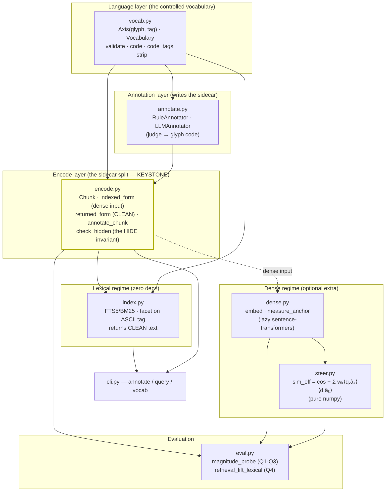
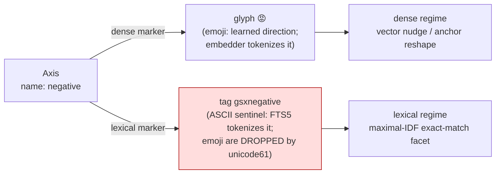
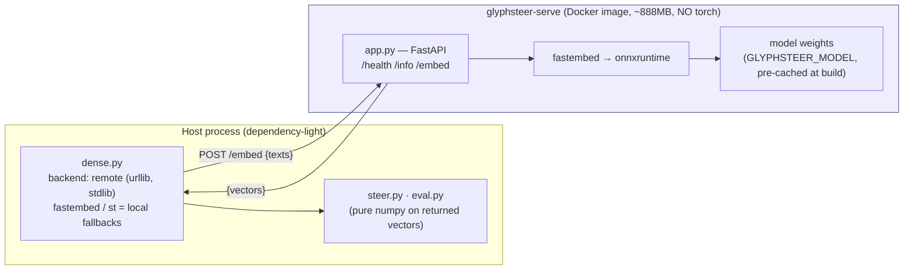

# GlyphSteer — Component Architecture

> Static structure. Update with every module/boundary change (rule 00). Arrows = depends-on.

## Whole-package component diagram

## The dual-rendering of one axis (the central finding)

## The dense sidecar (containerized neural runtime)

The heavy neural runtime lives OFF the host, in a container; the host calls it over HTTP.

- Swapping the embedding model = one env var (`GLYPHSTEER_MODEL`) → rebuild. This is what
  made the emoji-collapse failure (see DW-6) discoverable and fixable.
- The container is **embeddings-only**; all steer/probe math stays host-side on the vectors.

## Boundary notes
- `encode.py` is the **only** place the indexed-form/returned-form split is defined; the
  HIDE invariant (`check_hidden`, `index.assert_hidden`) is enforced at every read boundary.
- `dense.py` is the **only** import of `sentence-transformers`; it is lazy, so the whole
  left side runs with `pip install glyphsteer` (no extra).
- `steer.py` is **pure numpy** — it takes vectors, never the model, so the metric math is
  testable without any download.
