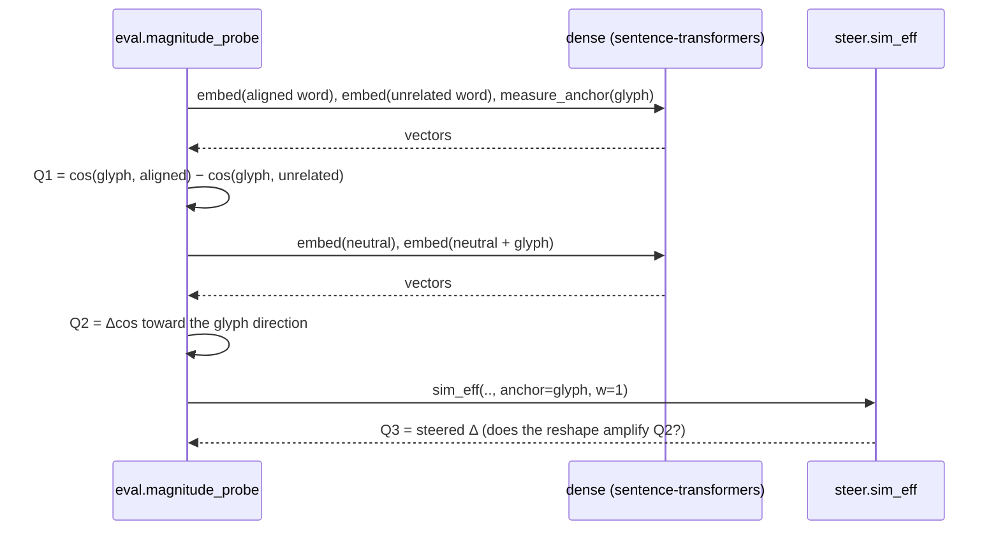
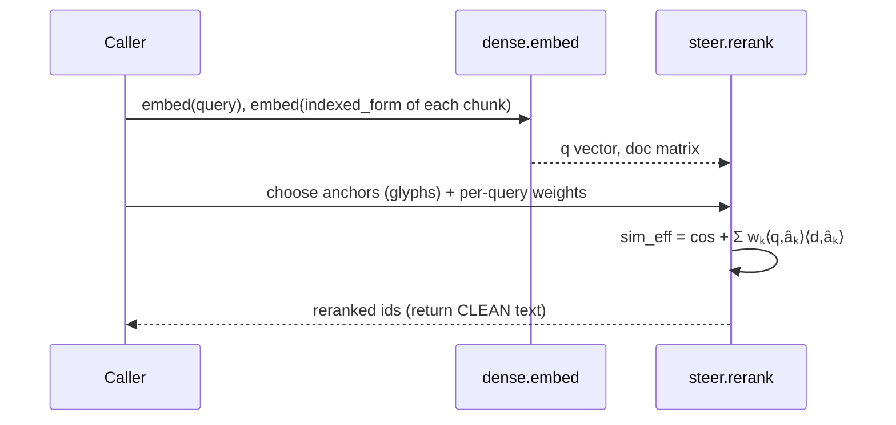
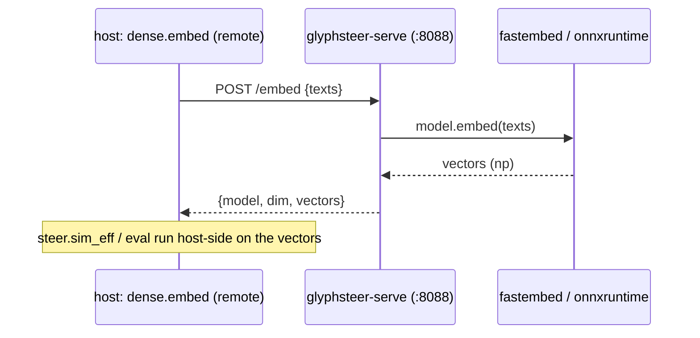

# GlyphSteer — Activity Flows & Development Workflows

> Runtime sequences + discovered build/verify procedures. Update with every flow change
> and every discovered dev workflow (rule 00).

## Runtime flow 1 — Annotate → Encode → Index → Retrieve (the lexical loop)

```mermaid
sequenceDiagram
    participant Corpus
    participant Ann as RuleAnnotator
    participant Enc as encode.annotate_chunk
    participant Idx as index.build_index (FTS5)
    participant U as Caller
    participant S as index.search

    Note over Corpus,Idx: INDEX TIME
    Corpus->>Ann: clean chunk text
    Ann->>Ann: predicates fire → axes
    Ann-->>Enc: [Annotation(glyph)]
    Enc->>Enc: strip stray glyphs; attach code (😡🔥)
    Enc-->>Idx: Chunk(text=clean, code=😡🔥)
    Idx->>Idx: body=clean · code=ASCII tags (gsxnegative …) · clean stored
    Note over U,S: QUERY TIME
    U->>S: query="pipeline", facet=😡
    S->>S: facet glyph → tag (gsxnegative); BM25 + code MATCH
    S-->>U: hits with CLEAN text (HIDE enforced)
```

## Runtime flow 2 — Dense magnitude probe (Q1–Q3)



## Runtime flow 3 — Dense retrieval with anchor reshape (ASPIRATIONAL until Q1–Q3 clear)



---

## Development Workflows (discovered while building — rule 00 §3)

### DW-1 — Verify any new marker against the tokenizer BEFORE trusting it
**Discovered:** building `index.py`, the emoji facet returned 0 hits. **Cause:** FTS5's
`unicode61` tokenizer drops emoji (treats them as separators); only ASCII-alphanumeric
runs index. **Procedure for any new lexical marker:**
```python
import sqlite3
con = sqlite3.connect(":memory:"); con.execute("CREATE VIRTUAL TABLE t USING fts5(c)")
con.execute("INSERT INTO t(c) VALUES (?)", (MARKER,))
print(con.execute("SELECT count(*) FROM t WHERE t MATCH ?", (f'"{MARKER}"',)).fetchone())
```
If it prints `(0,)` the marker is NOT lexically indexable → it must get an ASCII `tag`.
**Design consequence:** one axis, two renderings — emoji for dense, ASCII tag for lexical.

### DW-2 — Lexical first, dense gated
The lexical regime is exact-match true and provable with zero deps; build & verify it
first (`pytest`, `experiments/retrieval_lift.py`). The dense regime is gated on the
magnitude probe (Q1–Q3) — do NOT wire dense retrieval into a claim until
`experiments/magnitude_probe.py` shows the nudge is large enough to reorder. Keep
`sentence-transformers` a lazy optional extra so CI stays fast and dep-light.

### DW-3 — The HIDE invariant is a hard gate
Any change to encode/index must keep `check_hidden` / `assert_hidden` green: no
vocabulary glyph may appear in returned text. Treat a leak as a kill criterion (stop, fix,
re-run) — a leaked marker pollutes the generator's context, defeating the whole method.

### DW-4 — Findings go in the plan with their command
Every empirical result (tokenizer behavior, magnitude numbers, retrieval lift) is written
into `implementation_plan.md` §3/§5 **with the command or test that produced it**, in the
same commit — so the claim is reproducible, not folklore.

### DW-5 — Install/test loop
```bash
cd packages/glyphsteer && python3 -m pip install -e . -q && python3 -m pytest -q
# dense via the sidecar (preferred): see DW-7. local fallback: pip install -e '.[dense]'
```

### DW-6 — Check emoji-collapse BEFORE trusting any dense model
**Discovered:** the magnitude probe gave *identical* Q2 for all 5 glyphs, and a direct
check showed all distinct emoji had pairwise cosine **1.000** under `bge-small-en-v1.5` —
its WordPiece tokenizer maps every emoji to `[UNK]`. The dense claim is *impossible* on
such a model. A byte-aware multilingual model (`paraphrase-multilingual-MiniLM-L12-v2`,
XLM-R sentencepiece) gave distinct emoji (cos 0.77–0.97) and clean Q1 separation (+0.28…+0.58).
**Procedure — run first against any candidate model:**
```bash
GLYPHSTEER_EMBED_URL=http://localhost:8088 python experiments/emoji_collapse_check.py
# mean off-diagonal cosine ≈1.0 ⇒ COLLAPSED (reject); well below ⇒ distinct (proceed)
```
**Rule:** never report a dense number without first proving the model isn't emoji-blind.

### DW-7 — Stand up the dense sidecar
```bash
cd packages/glyphsteer/serve
GLYPHSTEER_MODEL=sentence-transformers/paraphrase-multilingual-MiniLM-L12-v2 \
  docker compose up --build -d
curl localhost:8088/health
# then point the host at it:
export GLYPHSTEER_EMBED_URL=http://localhost:8088
python experiments/emoji_collapse_check.py   # DW-6 gate
python experiments/magnitude_probe.py        # Q1–Q3
```

## Runtime flow 4 — Dense via the sidecar (host ↔ container)


